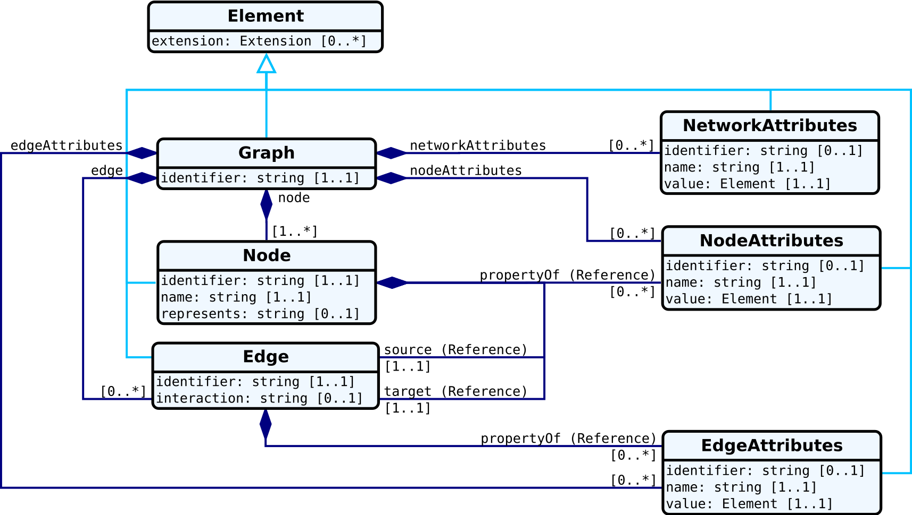

# FHIRgraph

A graph datatype structure definition for [FHIR® (Fast Healthcare Interoperability Resources)](hl7.org/fhir)


```diff
- Warning: This is work in Progress!!!
```

## The goal...

...is to create a [complex data type](http://hl7.org/implement/standards/fhir/datatypes.html#complex) for graph and network data on FHIR.

## Features

+ Graphs as list of nodes and edges
+ Aspect-oriented - different types of information about network elements are separated into modules ("aspects")
+ Designed to reduce message payload in common REST protocols through separation of aspects

## Content

+ [StructureDefinition](https://www.hl7.org/fhir/structuredefinition.html) for graphs in FHIR
+ Resource data examples
+ UML representation



## Overview

FHIR® – Fast Healthcare Interoperability Resources ([hl7.org/fhir](hl7.org/fhir)) – is a next generation standards framework created by HL7. FHIR combines the best features of [HL7's v2](http://www.hl7.org/implement/standards/product_brief.cfm?product_id=185), [HL7 v3](https://www.hl7.org/implement/standards/product_brief.cfm?product_id=186) and [CDA](http://www.hl7.org/implement/standards/product_brief.cfm?product_id=7) product lines while leveraging the latest web standards and applying a tight focus on implementability.

FHIR solutions are built from a set of modular components called "Resources". These resources can easily be assembled into working systems that solve real world clinical and administrative problems at a fraction of the price of existing alternatives. FHIR is suitable for use in a wide variety of contexts – mobile phone apps, cloud communications, EHR-based data sharing, server communication in large institutional healthcare providers, and much more.

Networks are a powerful and flexible methodology for expressing biological knowledge for computation and communication. Albeit its benefits, the sharing of networks, the collaboration on network curation, keeping track of changes between different network versions, and detecting different versions itself, still is a major problem in network biology.

The Network Data Exchange, or NDEx, is an open-source software framework to manipulate, store and exchange networks of various types and formats (Pratt et al., 2015, Cell Systems 1, 302-305, October 28, 2015 ©2015 Elsevier Inc. ScienceDirect). For the exchange of network data, NDEx uses the Cytoscape Cyberinfrastructure Network Interchange Format, or just [CX format](http://www.home.ndexbio.org/data-model/).

Currently, there's no [complex data type](http://hl7.org/implement/standards/fhir/datatypes.html#complex) available to represent networks within the FHIR framework, despite its increasing application in research. 

## Implementation

This repository also includes a implementation of the graph structure as RESTFull server. The server connects to the [public NDEx website](https://www.ndexbio.org) and provides the accessible networks as FHIR compliant resource.

The [HAPI-FHIR library](http://hapifhir.io/) forms the base for the server implementation ([FHIR-Graph-Server](fhir-graph-jpaserver/README.md)), i.e., the graph server was cloned from the [hapi-fhir-jpaserver-example](https://github.com/jamesagnew/hapi-fhir/tree/master/hapi-fhir-jpaserver-example). Also see the documentation of the original [JPA Server](http://hapifhir.io/doc_jpa.html).

For the connection to the NDEx server and convenient access to commonly methods, especially those for network I/O, search, and query, the provided [NDEx Java Client](https://github.com/ndexbio/ndex-java-client) and the accompanying [Java object model](https://github.com/ndexbio/ndex-object-model) are used.
